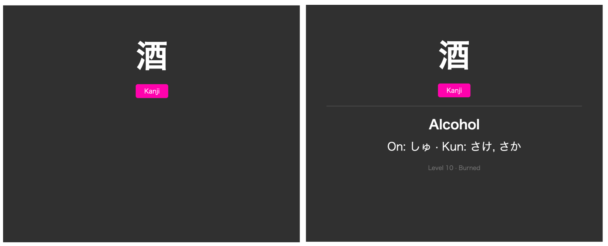

# Burnki ⭐

Burnki is an Anki add-on that automatically syncs your burned [WaniKani](https://www.wanikani.com/) items into an Anki deck.

WaniKani stops reviewing items once they reach "Burned" status. Burnki picks up where WaniKani leaves off by fetching all your burned radicals, kanji, and vocabulary, and creating Anki cards out of them. Helpful when you want to review what you've learned already!

I initially made this add-on just for me, but I figured it might be useful to others too. If you have any feedback or suggestions, please let me know!

## What Burnki does

- Syncs all burned radicals, kanji, and vocabulary from your WaniKani account
- Automatic and manual sync on Anki startup (configurable)
- Incremental sync — only fetches new burns after the first run
- Downloads pronunciation audio for vocabulary cards
- Includes your personal meaning/reading notes and synonyms from WaniKani

## Installation

### From AnkiWeb

*(Coming soon)*

### Manual Install

1. Download or build `burnki.ankiaddon` (see [Development](#development))
2. In Anki, go to Tools → Add-ons → Install from file
3. Select the `.ankiaddon` file
4. Restart Anki

## Setup

1. Get your WaniKani API token from [WaniKani Settings](https://www.wanikani.com/settings/personal_access_tokens) (read-only permissions are enough)
2. In Anki, go to Tools → Add-ons
3. Select **Burnki** and click **Config**
4. Paste your API token into the `wanikani_api_token` field
5. Restart Anki or use Tools → Burnki → Sync Now

## Configuration

| Setting | Default | Description |
|---------|---------|-------------|
| `wanikani_api_token` | `""` | Your WaniKani API token |
| `auto_sync_on_startup` | `true` | Auto-sync when Anki opens |
| `download_audio` | `true` | Download pronunciation audio for vocabulary cards |
| `last_sync_timestamp` | `""` | Last sync time (managed automatically) |

## Card Format

Each card shows the character(s) on the front with a color-coded type badge:

- **Radical**: blue
- **Kanji**: pink
- **Vocabulary**: purple

The back shows meanings, readings, audio (vocabulary), context sentences, and your personal notes.



## Development

### Requirements

- Anki 2.1.50 or later
- Python 3.9+ (bundled with Anki)

### Local Development

Symlink the add-on into Anki's add-ons folder for live development:

```sh
ln -s /path/to/burnki/burnki ~/Library/Application\ Support/Anki2/addons21/burnki
```

### Building

```sh
make build
```

This creates `dist/burnki.ankiaddon` ready for distribution.

## License

MIT
